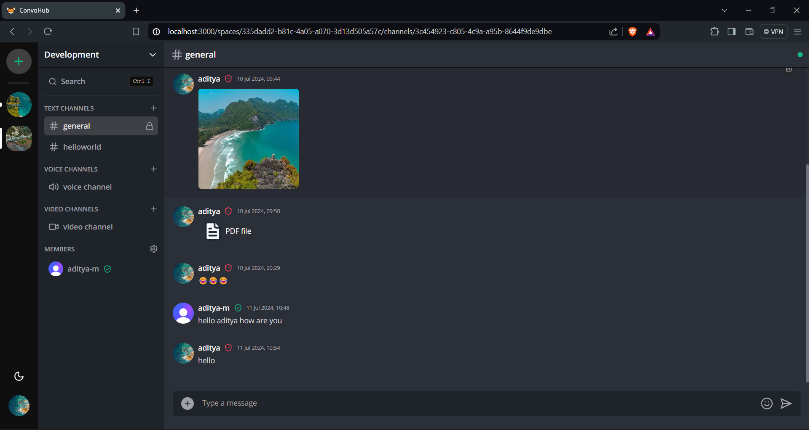
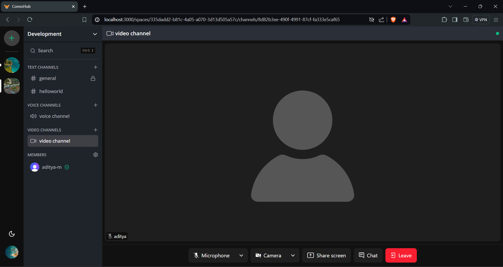
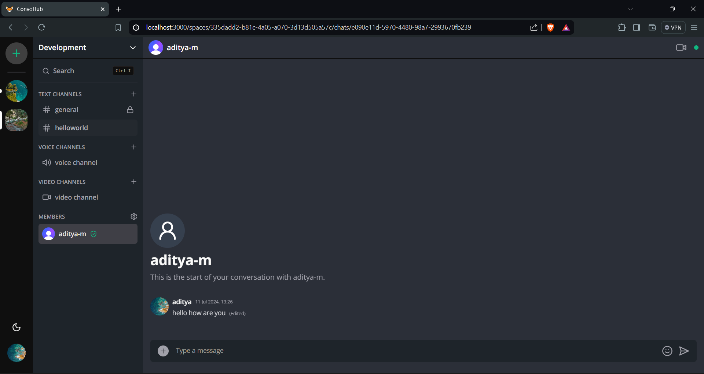
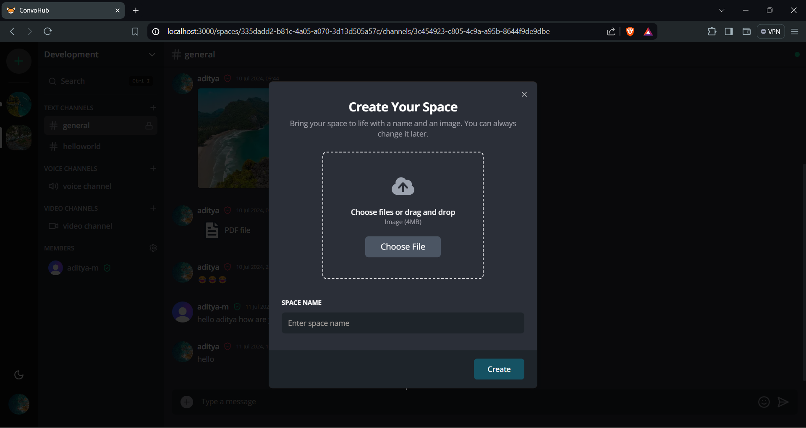
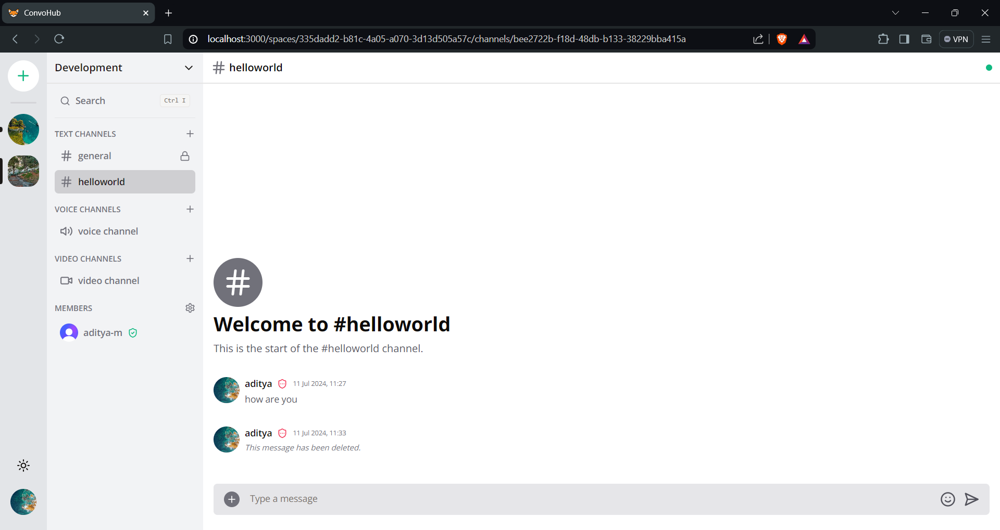

# ConvoHub

Welcome to ConvoHub, a modern communication platform designed to enhance community building. Leveraging the latest web technologies, ConvoHub offers a robust solution for seamless chat, voice, and video communication.


## Features

- **Real-time Messaging**: Instant messaging with friends and community members.
- **Voice Channels**: High-quality voice channels for group conversations.
- **Video Calls**: One-on-one and group video calling capabilities.
- **Roles and Permissions**: Manage server roles and permissions with ease.

## Tech Stack

- **Frontend**: NextJs, React, Zustand, Shadcn UI, TypeScript
- **Backend**: NextJs API routes, TypeScript
- **Database**: PostgreSQL with Prisma
- **Real-time Communication**: Socket.io
- **Authentication**: Clerk

## Screenshots

Here are some screenshots of ConvoHub in action:











## Installation

To run ConvoHub locally, follow these steps:

1. Clone the repository:
    ```bash
    git clone https://github.com/aditya-matwandkar/convohub-chat-app.git
    cd convohub
    ```

2. Install dependencies:
    ```bash
    # NPM
    npm install
    # Or, use any package manager of your choice.
    ```

3. Create a `.env` file with the following variables:
    ```env
    NEXT_PUBLIC_CLERK_PUBLISHABLE_KEY=
    CLERK_SECRET_KEY=
    NEXT_PUBLIC_CLERK_SIGN_IN_URL=
    NEXT_PUBLIC_CLERK_SIGN_UP_URL=

    DATABASE_URL=

    UPLOADTHING_SECRET=
    UPLOADTHING_APP_ID=

    LIVEKIT_API_KEY=
    LIVEKIT_API_SECRET=
    NEXT_PUBLIC_LIVEKIT_URL=
    ```

4. Generate the Prisma client:
    ```bash
    npx prisma generate
    ```

5. Push the database schema:
    ```bash
    npx prisma db push
    ```

6. Run the development server:
    ```bash
    npm run dev
    ```

7. Open your browser and navigate to `http://localhost:3000`.
